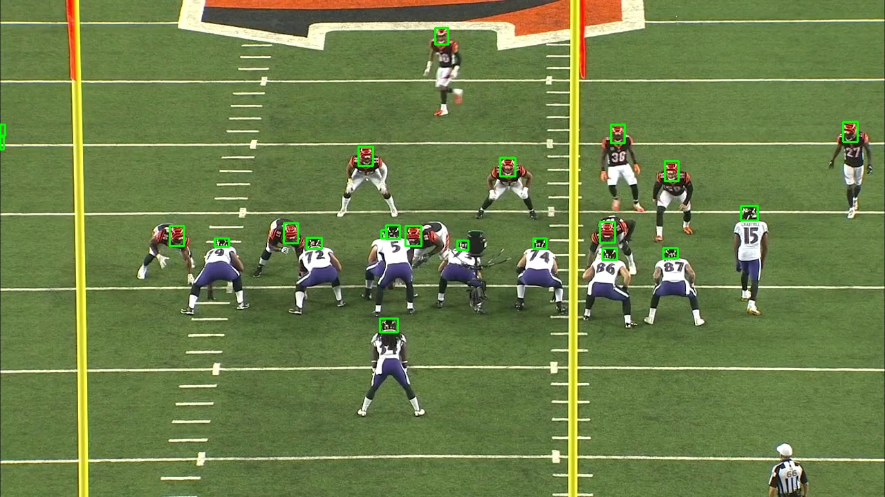
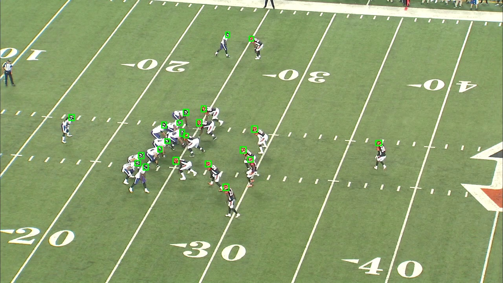
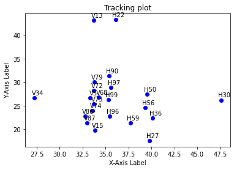
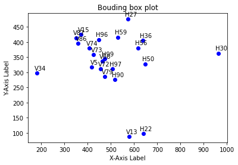

This repo contains the code base for the technical exercice for the Skillcorner interview.

The main tasks are:

1. Visualize helmets detection and plot tracking data

2. Think of / Implement a solution to identify helmet detections based on tracking data

I took into account the provided recommendation to approach the exercise as a problem-solving task.
My contemplations revolve around these two ideas:

Idea 1. Identify the helmets corresponding to the bounding box data based on the tracking data.

	We assume we know each helmet's team.

	Step 1: Calculate the distance matrix between the helmets using the tracking data and the bounding box data.

	Second step: Identify the closest players of both teams on the basis of the distance matrices.

	=> One player is identified per team

	Third step: Iterative process: For a player on team A, find the player closest to him on the same team. 

	At each stage, players already identified are removed from the team.

	Main challenges: Distances between players calculated using tracking data are not proportional to those calculated using bouding box data.
 

Idea 2. Identify the followed curve of each Helmet bounding box center.
        Check the closest curve to the Helmet box center among the tracking curves of players for identification.
        => Use distances that conserve geometrical properties of the curves.
        Main challenges: Project tracking  and bounding box curves in the same plan.

Code details: 

1. [extract_tr_bb_dataframes.py](./extract_tr_bb_dataframes.py) extracts list of players, boudning box and tracking 
   dataframes of each player related to a specific video game.

2. Visualize Helmet detections:
   [extract_frames.py](./extract_frames.py) extracts frames from a given video.
   [draw_bounding_boxes.py](./draw_bounding_boxes.py) draws rectangles around identified Helmets.

   
   

3. Visualize tracking data:
   [plot_tracking_data.py](./plot_tracking_data.py) plots the curve followed by a player.
   

4. Synchronize tracking and bouding box data
   [extract_tacking_dataframe_video.py](./extract_tacking_dataframe_video.py) generates a new tracking dataframe per player
   corresponding to a given video.

5. Visualize player graphs:
   [display_bb_tr_graphs.py](./display_bb_tr_graphs.py) plots the graphs of players showing their positions based on tracking 
   and bounding box data corresponding to the same event.
   
   

6. Identify the team of each helmet:
   [identify_helmets_team.py](./identify_helmets_team.py) applies a clustering algorithm to identify the team of each helmet.

7. Idea 1: [match_players.py](./match_players.py) 

8. Idea 2: [find_similar_bb_tr_curves.py](./find_similar_bb_tr_curves.py) 