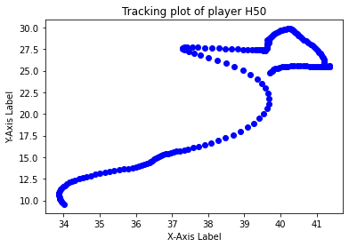

This repo contains the code base for the technical exercice for the Skillcorner interview.

The main tasks are:

1. Visualize helmets detection and plot tracking data

2. Think of / Implement a solution to identify helmet detections based on tracking data

I took into account the provided recommendation to approach the exercise as a problem-solving task.
My contemplations revolve around these two ideas:

1. Create visual representations of the graphs for helmet positions using bounding box and tracking data at the same time.
   Map points on both graphs to identify Helmet IDs.
   Main challenge: how to synchronize bounding box detections and tracking data (different number of frames and tracking points). 

2. Identify the followed curve of each Helmet bounding box center.
   Check the closest curve to the Helmet box center among the tracking curves of players for identification.
   => Use distances that conserve geometrical properties of the curves.
   Main challenges: Project tracking  and bounding box curves in the same plan.

Code details: 

1. [extract_tr_bb_dataframes.py](./extract_tr_bb_dataframes.py) extracts list of players, boudning box and tracking 
   dataframes of each player related to a specific video game.

2. Visualize Helmet detections:
   [extract_frames.py](./extract_frames.py) extracts frames from a given video.
   [draw_bounding_boxes.py](./draw_bounding_boxes.py) draws rectangles around identified Helmets.
   
   
   
   

3. Visualize tracking data:
   [plot_tracking_data.py](./plot_tracking_data.py) plots the curve followed by a player.
   

4. Visualize tracking data:
   [display_bb_tr_graphs.py](./display_bb_tr_graphs.py) plots the graphs of players showing their positions based on tracking 
   and bounding box data corresponding to the same event.
   
   

5. Idea 1: 

6. Idea 2:
   [find_similar_bb_tr_curves.py](./find_similar_bb_tr_curves.py) 